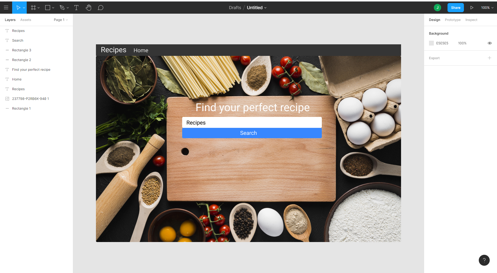
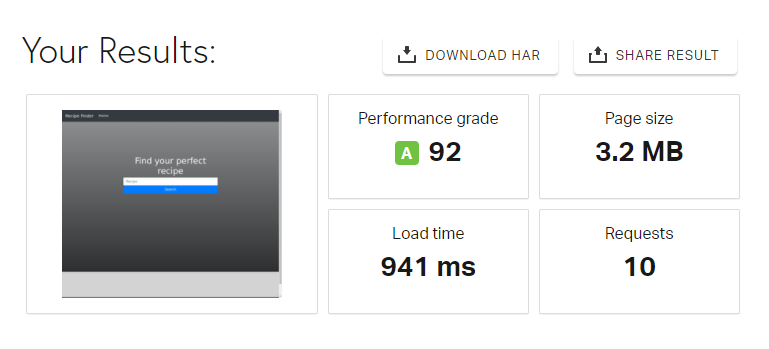

# My Resume

Milestone Project - 2 - rpi recipes

I have developed this page to provide a search based website. I have bulit this as a single page website that has an api search for any recipes.

The was designed to show a whole range of resipes show show any kind of meal or deserts that any one was looking to cook or bake.

Links below to my GitHub Pages and Github Repository:

- [Github Pages](https://jonathanuk84.github.io/Project-2-api-recipe/)

- [Github Repository](https://github.com/jonathanuk84/Project-2-api-recipe)

)

# UX
This website has been designed to act as an online recipes finder for people looking for specific meals or deserts. It has been created showing my skills 
in HTML, CSS and js so far.

# Wireframe

I desigined my site wireframe using Figma, please see link and screenshots below of my final draft. . 

[Figma - Click here to view my wireframe](https://www.figma.com/file/MQpvMBvXZ2Xhp8LNNiGMO6/Untitled?node-id=0%3A1)

My final product website has turned out exactly as planned with only 
a few little changes such as footer bar.:

1.  The top navbar is now fixed at the top to ensure ease of navigation from all points on the page.
2.  Boxes with pictures come up below main image showing recipes.

# User Stories
The main use for this site would be someone looking for recipes for something they want to bake or cook.

 Users can see:

- An easy to navigate front page.
- A simple search bar.
- A huge list of what they are searching.
- A home button to return back to search page.
- Full recipes on what they are searching. 

# Features
- **Home** - A home button to return right back to the search menu.
at the first glance. 
- **search bar** - This section will search any recipe that is inputted. 
- **navbar** - on a mobile divice there is a nice and easy drop down that has the return to home button.

# Technologies used

- [JavaScript](https://www.javascript.com/)
    * To add functionality to my api. 

- [CSS(Cascading Style Sheets)](https://www.w3.org/Style/CSS/Overview.en.html)
    * For Styling 

- [Bootstrap](https://getbootstrap.com/)
    * For HTML and CSS framework

- [Font Awesome](https://fontawesome.com/v4.7.0/)
    * For icons

- [Figma](https://www.figma.com)
    * To draft a wireframe

- [Am I Responsive](http://ami.responsivedesign.is/)
    * To test responsiveness on all screen sizes

- [GitHub Pages](https://jonathanuk84.github.io/Resume/.)
    * Website hosted on GitHub pages

- [Git](https://git-scm.com/)
    * For version control

- [GitHub](https://github)
    * Repository hosted on GitHub

- [Chrome DevTools](https://developers.google.com/web/tools/chrome-devtools)
    * To check site throughout development and inspect

- [Pingdom](https://tools.pingdom.com/)
    * To test the load time of the page

- [HTML](https://validator.w3.org/) 
    * To validate my HTML code

- [CSS validater](https://jigsaw.w3.org/css-validator/validator)
    * To validate my CSS code

- [HTML formatter](https://www.freeformatter.com/html-formatter.html#ad-output)
    * To ensure all HTML is formatted correctly 

# Testing 

- [HTML Validator](https://validator.w3.org/) checked that all of my HTML code is valid.

- [CSS Validator](https://jigsaw.w3.org/css-validator/) checked that all of my CSS code is valid.

- [Am I Responsive](http://ami.responsivedesign.is/) checked that my page is responsive on all screen sizes

- [Pingdom](https://tools.pingdom.com) checked the load time for my page

- [Chrome Inspect Dev Tools](https://www.google.com/chrome/)

- Tested on different browsers
    * **Internet Explorer** The heading section layout changes when loaded in Internet Explorer, when on small screen sizes the image is too big and scrolls, 
    on larger screen sizes.

- Checked all links work correctly and open in a seperate page. 
    * these ase the only error which I'm unsure how to fix.

    

- Checked that the navbar stays at the correct part of the page.

- Checked that the back and forward browser buttons work correctly with no errors. 

- Post code in peer review on slack
    * No responses yet!

- I have sent it to friends and family to test on other phones and tablets.
    it has been tested on iphones samsung s8/s10/s20 and ipad and samsung galaxy s4. 
    works find sideways or upright.

# Deployment and Demo 
The project is hosted on GitHub Pages

The process involved:

- Host a git repository on GitHub.

- Create project in GitPod saving each big change for version control to GitHub.

- Open your project repository in GitHub.

- Click on settings.

- Scroll down to the GitHub Pages section.

- Click on source and select master branch.

- After the page refreshes you will have a link to your deployed website.

- Final product now hosted on GitHub Pages.

To deploy your own version of the website:
- Have git installed

- Visit the repository

- Click 'Clone or download' and copy the code for http

- Open your chosen IDE (Cloud9, VS Code, etc.)

- Open a terminal in your root directory

- Type 'git clone ' followed by the code taken from github repository

- When this completes you have your own version of the website

- Feel free to make any changes to it

- The website can be run by opening one of the HTML files within a web browser

- Visit the link provided

- Your website with any made changes will appear

- Saved changes to the website will appear here after refreshing the page

The benefits of hosting your website on GitHub pages is that any pushed changes to your project will automatically update the website. Development branches can be created and merged to the master when complete.
It may take a moment for changes to appear on the hosted website.
During development the site is written in VS Code. It is run using Live Server plugin for VS Code.

#
 